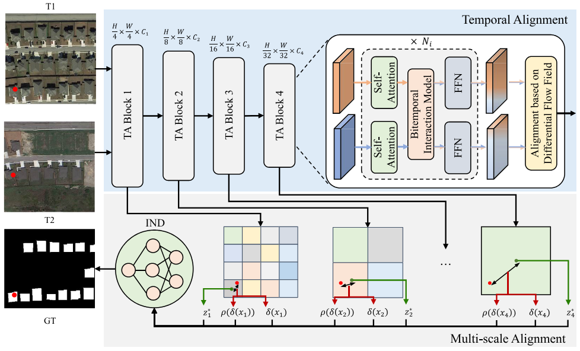

<div align="center">
    <h2>
        BiFA: Remote Sensing Image Change Detection with Bitemporal Feature Alignment
    </h2>
</div>
<br>

<div align="center">
  
</div>
<br>
<div align="center">
  &nbsp;&nbsp;&nbsp;&nbsp;
  <a href="https://ieeexplore.ieee.org/document/10471555">
    <span style="font-size: 20px; ">TGRS</span>
  </a>
  &nbsp;&nbsp;&nbsp;&nbsp;
  <a href="resources/BiFA.pdf">
    <span style="font-size: 20px; ">PDF</span>
  </a>
  &nbsp;&nbsp;&nbsp;&nbsp;
</div>
<br>
<br>

[](https://github.com/zmoka-zht/BiFA)
[](LICENSE)

<br>
<br>


## Introduction

This repository is the code implementation of the paper [BiFA: Remote Sensing Image Change Detection with Bitemporal Feature Alignment](https://arxiv.org/abs/2406.04207)

The current branch has been tested on Linux system, PyTorch 1.12.0 and CUDA 12.1, supports Python 3.7.

If you find this project helpful, please give us a star ⭐️, your support is our greatest motivation.


## Updates

🌟 **2024.06.20** Revised the BiFA project.

## Benchmark
### Change detection methods supported by the repository
- [X] FC-EF (ICIP'2018)
- [X] FC-Siam-diff (ICIP'2018)
- [X] FC-Siam-conc (ICIP'2018)
- [X] IFN (ISPRS'2020)
- [X] SNUNet (GRSL'2021)
- [X] SwinUnet (TGRS'2022)
- [X] BIT (TGRS'2022)
- [X] ChangeFormer (IGARSS'22)
- [X] MSCANet (JSTARS'2022)
- [X] Paformer (GRSL'2022)
- [X] DARNet (TGRS'2022)
- [X] ACABFNet (JSTARS'2023)
- [X] BiFA (TGRS'2024)
- [ ] ......

## TODO

- [ ] Updated more change detection methods

## Table of Contents

- [Introduction](#Introduction)
- [Benchmark](#Benchmark)
- [TODO](#TODO)
- [Table of Contents](#Table-of-Contents)
- [Installation](#Installation)
- [Dataset Preparation](#Dataset-Preparation)
- [Model Training and Testing](#Model-Training-and-Testing)
- [Citation](#Citation)
- [License](#License)
- [Contact Us](#Contact-Us)

## Installation

### Requirements

- Linux system, Windows, depending on `MMCV` can be installed
- Python 3.6+, recommended 3.7
- PyTorch 1.10+ or higher, recommended 1.12.0
- CUDA 11.7 or higher, recommended 12.1

### Environment Installation

It is recommended to use Miniconda for installation. The following commands will create a virtual environment named `bifa` and install PyTorch. In the following installation steps, the default installed CUDA version is **12.1**. If your CUDA version is not 12.1, please modify it according to the actual situation.

Note: If you are experienced with PyTorch and have already installed it, you can skip to the next section. Otherwise, you can follow the steps below.

<details open>

**Step 0**: Install [Miniconda](https://docs.conda.io/projects/miniconda/en/latest/index.html).

**Step 1**: Create a virtual environment named `bifa` and activate it.

```shell
conda create -n bifa python=3.7
conda activate bifa
```

**Step 2**: Install dependencies.

```shell
pip install -r requirements.txt
```
**Note**: Use the following command to install mmcv
```shell
pip install mmcv-full==1.6.2 -f https://download.openmmlab.com/mmcv/dist/cu113/torch1.12/index.html
```

</details>


### Install BiFA


You can download or clone the BiFA repository.

```shell
git clone git@github.com:zmoka-zht/BiFA.git
cd BiFA
```

## Dataset Preparation


### Remote Sensing Change Detection Dataset

We provide the method of preparing the remote sensing change detection dataset used in the paper.

#### WHU-CD Dataset

- Data download link: [WHU-CD Dataset PanBaiDu](https://pan.baidu.com/s/1nh7znToO4XwaZHIOo7gCmw). Code:t2sb


#### LEVIR-CD Dataset 

- Data download link: [LEVIR-CD Dataset PanBaiDu](https://pan.baidu.com/s/1bnJrXUYHe03Ab1HPuHk77A). Code:5ss2


#### LEVIR+-CD Dataset

- Data download link: [LEVIR+-CD Dataset PanBaiDu](https://pan.baidu.com/s/1ymcsUei7oDyyMUBbpUTGAw). Code: xtj8

#### SYSU-CD Dataset

- Data download link: [SYSU-CD Dataset PanBaiDu](https://pan.baidu.com/s/1tcM59rXxPLK_QzI4f0qB5A). Code: gk0w

#### CLCD-CD Dataset

- Data download link: [CLCD-CD Dataset PanBaiDu](https://pan.baidu.com/s/1I51WioEAfMpHCLkp-Kr8QQ). Code: bcml

#### DSIFN-CD Dataset

- Data download link: [DSIFN-CD Dataset PanBaiDu](https://pan.baidu.com/s/1cWYBEQvsgvlVbyJOWQIYUQ). Code: u8e9 


#### Organization Method

You can also choose other sources to download the data, but you need to organize the dataset in the following format：

```
${DATASET_ROOT} # Dataset root directory, for example: /home/username/data/LEVIR-CD
├── A
│   ├── train_1_1.png
│   ├── train_1_2.png
│   ├──...
│   ├── val_1_1.png
│   ├── val_1_2.png
│   ├──...
│   ├── test_1_1.png
│   ├── test_1_2.png
│   └── ...
├── B
│   ├── train_1_1.png
│   ├── train_1_2.png
│   ├──...
│   ├── val_1_1.png
│   ├── val_1_2.png
│   ├──...
│   ├── test_1_1.png
│   ├── test_1_2.png
│   └── ...
├── label
│   ├── train_1_1.png
│   ├── train_1_2.png
│   ├──...
│   ├── val_1_1.png
│   ├── val_1_2.png
│   ├──...
│   ├── test_1_1.png
│   ├── test_1_2.png
│   └── ...
├── list
│   ├── train.txt
│   ├── val.txt
│   └── test.txt
```

## Model Training and Testing

All configuration for model training and testing are stored in the local folder `config`

#### Example of Training on LEVIR-CD Dataset

```shell
python train.py --config/levir.json 
```

#### Example of Testing on LEVIR-CD Dataset

```shell
python test.py --config/levir_test_bifa.json 
```
#### BiFA Weight
- The model weights of BiFA are provided in the `experiments/pretrain`
- Segformer weight download link: [Segformer PanBaiDu](https://pan.baidu.com/s/1zxet_fQy6eZZQS3Ak9ChlQ). Code:i81p

## Citation

If you use the code or performance benchmarks of this project in your research, please refer to the following bibtex citation of BiFA.

```
@ARTICLE{10471555,
  author={Zhang, Haotian and Chen, Hao and Zhou, Chenyao and Chen, Keyan and Liu, Chenyang and Zou, Zhengxia and Shi, Zhenwei},
  journal={IEEE Transactions on Geoscience and Remote Sensing}, 
  title={BiFA: Remote Sensing Image Change Detection With Bitemporal Feature Alignment}, 
  year={2024},
  volume={62},
  number={},
  pages={1-17},
  keywords={Feature extraction;Task analysis;Remote sensing;Transformers;Interference;Decoding;Optical flow;Bitemporal interaction (BI);change detection (CD);feature alignment;flow field;high-resolution optical remote sensing image;implicit neural representation},
  doi={10.1109/TGRS.2024.3376673}}
```

## License

This project is licensed under the [Apache 2.0 License](LICENSE).

## Contact Us

If you have any other questions❓, please contact us in time 👬
